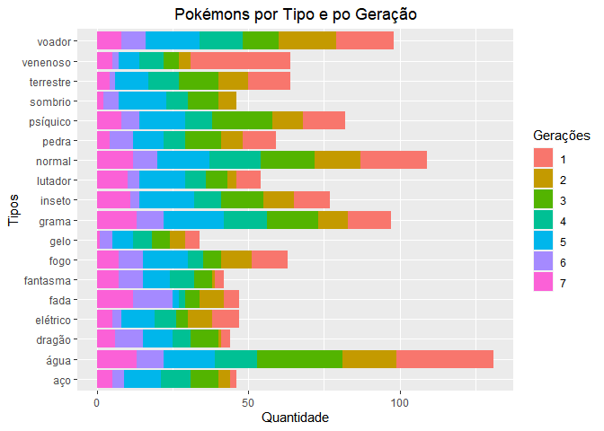

# Uma Análise do Pokémonverso

## Introdução

O presente projeto foi apresentado como trabalho de conclusão do curso
“R para ciência de dados II” ministrado pela Curso-r em 2021. Seu
propósito é responder a seguinte pergunta: Os pokémons da primeira
geração tornaram-se pokémons clássicos que são sempre imediatamente
lembrados quando se fala sobre a saga pokémon e que possuem um lugar
especial em nosso imaginário e coração, mas teriam os pokémons da
primeira geração atibutos (como por exemplo, hp, ataque, defesa,
velocidade) melhores do que os dos pokémons das gerações posteriores?
Será que há uma diferença de patamar entre os pokémons “clássicos” dos
pokémons mais novos?

Vamos descobrir juntes!

## A Base Pokémon

A base de dados “Pokémon” possui informações sobre peso, altura,
geração, nível de hp, de ataque, de defesa, de velocidade e de ataque e
defesa especiais para 949 variedades de pokémons. Além disso, a base de
dados ainda traz informações sobre o tipo do pokemón, sua cor e sua
imagem. A base pode ser encontrada
[aqui](https://github.com/curso-r/202104-r4ds-2/blob/master/data/pokemon.rds).

## Explorando os dados sobre os Pokémons

Primeiro, para iniciarmos, vamos explorar quantos pokémons de cada
geração a base de dados em questão apresenta.

Podemos notar que a quinta geração é a que apresenta maior número de
pokémons (156) seguida pela primeira geração que apresenta apenas 5
pokémons a menos do que a quinta geração (151) e logo atrás aparece a
terceira geração com 135 pokémons. A segunda e a quarta geração
apresentam cerca de 100 pokémons cada. E as gerações mais novas, sexta e
a sétima, apresentam uma menor quantidade de pokémons sendo
respectivamente 72 pokémons e 81 pokémons.

E interessante também observarmos a quantidade de pokémos de cada tipo
que existem nas gerações para, assim, obtermos uma descrição melhor
melhor dos nossos dados sobre os pokémons. Para tanto, foi considerada
na análise as variáveis “tipo\_1” e “tipo\_2” de forma conjunta em uma
variável chamada “tipos”.

## Os Atributos dos Pokémons ao longo das Gerações

Agora, vamos nos deter a análise da questão central que inspirou o
presente projeto que é se teriam os pokémons da primeira geração
atibutos (como por exemplo, hp, ataque, defesa, velocidade) melhores do
que os dos pokémons das gerações posteriores? Para tanto, se calculou a
média de cada atributo para cada geração.

### O Atibuto de Ataque

Conforme podemos observar, com relação ao atributo “ataque” os pokémons
da primeira geração não apresentam uma força de ataque maior do que os
pokémons das gerações posteriores. Pelo contrário, a sétima geração
(geração mais nova) é a que apresenta a maior média de força de ataque
dos pokémons seguida pelas quinta e quarta gerações.

A primeira geração apresenta uma média de ataque próximos aos valores da
terceira e sexta gerações. E a segunda geração é a que apresenta o menor
valor do atributo ataque. No gráfico, abaixo, após o reordenamento dos
elementos, tais aspectos ficam melhor evidenciados

### O Atributo Defesa

Vamos agora analisar o atributo de defesa ao longo das 7 gerações de
pokémons

Podemos observar que, com relação a média do atributo de defesa, os
pokémons da primeira geração ficam atrás dos pokemóns das gerações mais
novas, uma vez que a sétima geração apresenta uma média maior seguida da
sexta e quata gerações. Com valores bem próximos se encontram as demais
gerações. Novamente, podemos observar tais caracteristica melhor no
gráfico reordenado.

### O Atributo Velocidade

Proceguindo, vamos a analise do atributo de velocidade.

Nesse atributo, observamos que a primeira e a quarta gerações aparecem
com valores um pouco maiores do que das outras gerações e que são a
segunda e terceira gerações que aprecentam os menos valores. Ao meio
ficam a sétima, sexta e quinta gerações. Vamos conferir melhor no
gráfico reordenado!

### O Atributo HP

Para finalizar, vamos a análise do último atributo que o Hp.

Com relação a esse atributo, novamente a primeira geração aparece com
menor valor de média e em sua cola aparece a terceira geração. Com
valores bastante próximos aparecem a sexta, quinta, sétima e segunda
gerações e a quarta geração aparece com a maior média, apesar da pouca
diferença com relação as demais gerações. Observe o gráfico reordenado:

## Conclusões

Conclui-se da análise realizada que os pokémons das gerações mais novas
não ficam devendo em nenhum aspecto para os pokémons da primeira geração
e que diferente do que possa se pensar os pokémons da primeira geração
não estão em um patamar diferenciado em relação aos pokémons das outras
gerações. Nota-se, inclusive, que os valores dos atributos são bem
próximos um dos outros e, assim, não há uma diferença grande entre os
pokémons devido a pertencerem a esta ou aquela geração

